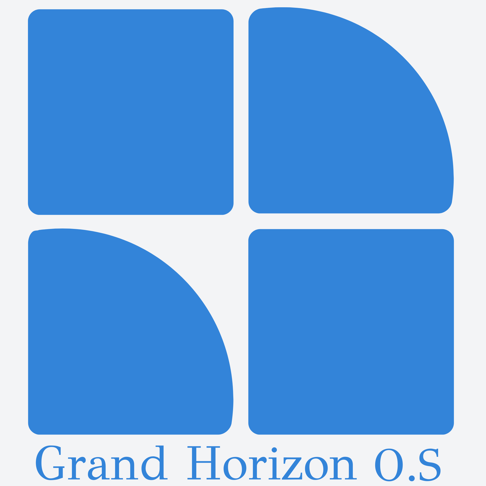

	
	<h1 align="center">OS Grand Horizon</h1>

	<b>Open-source PMS</b> (Property Management System)

## Table of Contents

* [What is OS Grand Horizon?](#what-is-os-grand-horizon)
* [Features](#features)
* [Installation](#installation)
* [Code of conduct](#code-of-conduct)
* [Contribute](#contribute)
* [How to develop an extension](#how-to-develop-an-extension)
* [Versioning](#versioning)
* [License](#license)

## What is OS Grand Horizon?
OS Grand Horizon is an open-source PMS (Property Management System). It was
originally designed for hotel software companies, but other businesses like
car rental businesses can use it also.

## Our mission
We see hundreds of PMS companies developing the same features and
integrations as everyone else, and we think it's a waste of resources. Our
mission is to develop a single best technology that can perform better than
most PMS companies' in-house developed products, and completely take the
technical burden off of their shoulders.

## Features
* <b>Online Booking Engine&nbsp;:</b>&nbsp;Accept online bookings from 3rd party websites.
* <b>Inventory&nbsp;:</b>&nbsp;Control room availabilities of your property.
* <b>CRM&nbsp;:</b>&nbsp;Manage customer profiles along with their account balances.
* <b>Intuitive Calendar&nbsp;:</b>&nbsp;Simple interface that provides quick overview of your property.
* <b>Payment&nbsp;:</b>&nbsp;Accept secure payments online.

...and an extension architecture for adding more (see
[PLAN.md](PLAN.md) for the Sea Panther Reservas extensions built on top of it).

## Installation

See [SETUP.md](SETUP.md) for the exact, verified steps (Docker-based local
setup, migrations, seed data, and known fixes for getting a fresh checkout
running).

Short version:
* Install PHP 7.4+, a MySQL-compatible database (MariaDB works), and Composer.
* Copy `.env.example` to `.env` and fill in database credentials and URLs.
* Run `composer install` (or `composer update` if the lock file is out of sync).
* Run the CodeIgniter migrations (`/migrate`) to create the schema.
* Seed lookup data via the install wizard (`/install/index.php`) or its two
  underlying endpoints.
* Register the first admin account and log in.

## Code of Conduct
OS Grand Horizon follows the [Codeigniter Style Guide](https://codeigniter.com/userguide3/general/styleguide.html).

## Contribute

Any contribution for a new feature or an improvement will be appreciated.
###### To make a contribution:
1. Fork the repository and edit.
2. Submit the pull request, please provide a comprehensive description of the PR as a commit message.
3. Please ensure your code follows the [Codeigniter Style Guide](https://codeigniter.com/userguide3/general/styleguide.html).

## How to develop an extension
Extensions live under `public/application/extensions/<name>/` as self-contained
HMVC modules (CodeIgniter 3 + wiredesignz MX). See PLAN.md §1 for the exact
module structure (config/config.php, config/route.php, controllers/, models/,
views/) and how activation works.

## Versioning

The version is broken down into 4 points e.g 1.2.3.4. We use
MAJOR.MINOR.FEATURE.PATCH to describe the version numbers.

A MAJOR is very rare, it would only be considered if the source was
effectively re-written or a clean break was desired for other reasons. This
increment would likely break most 3rd party modules.

A MINOR is when there are significant changes that affect core structures.
This increment would likely break some 3rd party modules.

A FEATURE version is when new extensions or features are added (such as a
payment gateway, shipping module, etc). Updating a feature version is at a
low risk of breaking 3rd party modules.

A PATCH version is when a fix is added, it should be considered safe to
update patch versions e.g 1.2.3.4 to 1.2.3.5.

## License

[The Open Software License 3.0 (OSL-3.0)](LICENSE)
